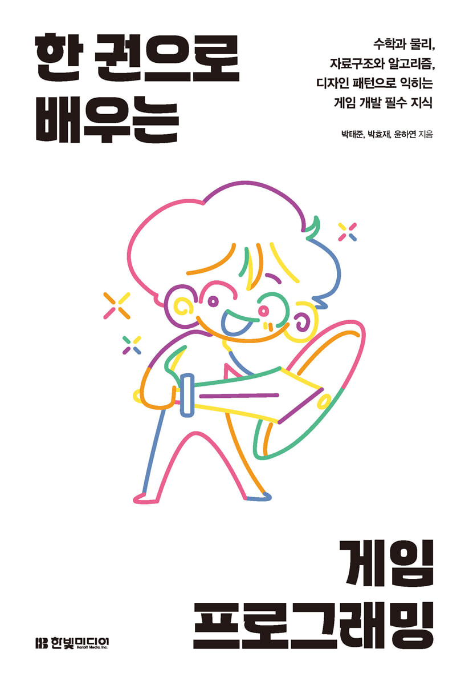
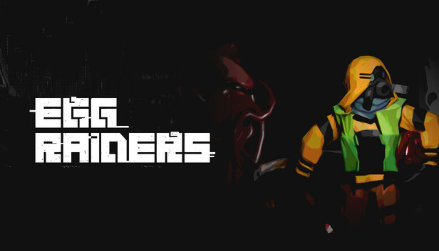
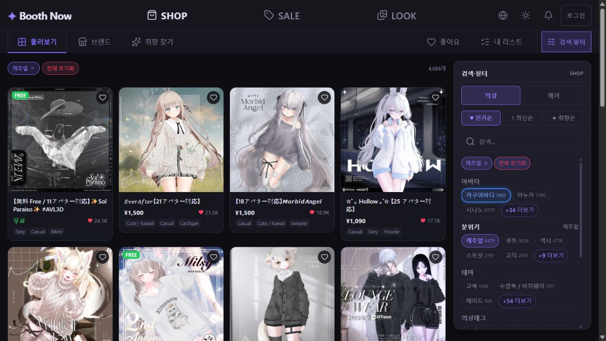
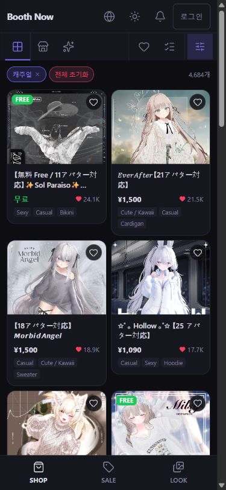

# Taejoon Park · 박태준 (Rekorn)

Game developer leading **MoEater**, a three-person team. Former developer at **Com2us and Com2Verse**. First-listed co-author of a game programming book published by **Hanbit Media**.

[Portfolio](https://rekorn.com/en/) · [한국어 포트폴리오](https://rekorn.com/) · [MoEater](https://moeater.com/) · [LinkedIn](https://www.linkedin.com/in/rekorn/)

## Book

**[한 권으로 배우는 게임 프로그래밍](https://www.yes24.com/product/goods/135854770)** — first-listed co-author, Hanbit Media, October 2024. Covers the math, physics, algorithms, data structures and design patterns used in game development.

## Games

| Work | My role | Release |
| --- | --- | --- |
|  [EULA ~2026 Human Creativity Report~](https://store.steampowered.com/app/4517370/EULA/) | PD & Programming | Released on Steam · 2026-07-10 |
|  [EGG RAIDERS](https://store.steampowered.com/app/3253440/EGG_RAIDERS/) | Development Lead · CTO at Misoge | Steam Early Access · 2024-10-30 |
|  [EULA Demo ~하트 콩닥 미술부~](https://store.steampowered.com/app/4664420/EULA_Demo_HeartDokidoki_Art_Club/) | A MoEater title | Free demo with a separate story · 2026-04-30 |

**GynoFactory** is in development: a factory automation game. EULA Demo is a free demo with a story distinct from the full game.

## Open-source contribution

**[Friflo.Engine.ECS #126](https://github.com/friflo/Friflo.Engine.ECS/pull/126)** — Fixed a relation deserialization bug that created a phantom component and added three regression tests. Merged by the maintainer. April 2026.

## AI development

I have used Claude Code since its initial release. I build project-specific development environments around Codex and Claude Code, with Jev integrated into code review.

I build games, desktop and Android applications, web applications and production tools. I also develop workflow automation and help teams adopt AI development tools in their existing projects.

## Technology

| Area | Tools |
| --- | --- |
| Game engines & platforms | Unity, Godot, Stride, Android |
| Languages & frameworks | C#, .NET, Java, Python, TypeScript, React, XML |
| Web frontend | React, JavaScript, CSS, Vite, React Router, Lucide React |
| Client & systems | WebRTC, WebView2, Friflo.Engine.ECS |
| Computer vision & XR | TensorFlow, OpenCV, HoloLens, VR |
| AI development | Codex, Claude Code, Jev (TypeSafe) |
| Development & collaboration | Git, Jira, Confluence, Jenkins, Android Studio |
| Production & documentation | Blender, Excel, PowerPoint, Word, 한글 / Hancom HWP |
| Foundational experience | C, C++, Unreal Engine |

## Experience

| Period | Company | Role |
| --- | --- | --- |
| 2026-09–present | [BOOTH NOW](https://booth-now.com/) | Frontend & UI/UX · Team Member |
| 2026-05–present | MoEater | Studio Head |
| 2024-09–2025-06 | Misoge | Chief Technology Officer |
| 2023-08–2024-07 | CSS | Game Programmer |
| 2022-04–2023-08 | Com2Verse | Client Developer |
| 2022-01–2022-03 | Com2us | Client Developer, ECO |

## Research and education

- Co-author of **[MRHMDを用いたコンクリート壁面のインタラクティブひび割れ検査システムの開発](https://gakkai-web.net/iee/program/2020/data/html/general/general5.html)**, IEEJ 2020 National Convention, paper 3-040. Research on HoloLens-based concrete crack inspection.
- **University of Tsukuba**, Bachelor's degree, Engineering Systems (2016-04–2020-03). Selected for the Korea–Japan Joint Scholarship Program for Science and Engineering Undergraduates; Japanese language training in 2015–2016.
- **Korea Digital Media High School**, Hacking Defense (2012-03–2015-02).

## Apps, web services and developer tools

- **[BOOTH NOW](https://booth-now.com/)** — I joined BOOTH NOW in September 2026 as the team member responsible for frontend development and UI/UX. The VRChat avatar asset discovery service covers over 25,000 products and 3,800 brands in Korean, Japanese and English. My work includes React frontend development and a responsive UI redesign for desktop and mobile. Catalog figures are as of September 2026.

- **[RekornTools.Avatar](https://booth.pm/ja/items/3860932)** — a Unity editor asset sold on BOOTH.
- **[TSF Support](https://marketplace.visualstudio.com/items?itemName=rekorn.tsf-support)** — A VS Code extension that highlights sentence elements for web fiction writers, distributed on the Marketplace.
- **[LinearBeats](https://github.com/urun4m0r1/LinearBeats)** — A Unity rhythm game and chart editor using the full keyboard.
- **[CrackManager](https://github.com/urun4m0r1/CrackManager)** — Public C# code from the mixed reality concrete crack inspection research.
- **[RGTool](https://rekorn.notion.site/d80b4601deba46008005275379aa6357)** — A Java Android app for rhythm-game information and play records.
- **[꿈드림](https://rekorn.notion.site/d80b4601deba46008005275379aa6357)** — An assistive Android app developed in a student startup club using Java and OpenCV.
- **[Albida Soft](https://rekorn.notion.site/d80b4601deba46008005275379aa6357)** — Over 23 Android apps built in a student startup club. An archive of early work; distribution has ended.
- **[Rekorn’s TechBlog](https://rekorn.oopy.io/)** — Technical notes on Unity, Unreal and game development.

Qualifications and awards

| Date | Qualification / test |
| --- | --- |
| 2009-02 | Craftsman Information Processing |
| 2011-02 | Craftsman Information Equipment Operation |
| 2011-05 | Word Processor, Level 1 |
| 2010-04 | Computer Specialist in Spreadsheet & Database, Level 2 |
| 2010-08 | ITQ Hangul Excel, Grade A |
| 2010-03 | ITQ Hangul PowerPoint, Grade A |
| 2015-07 | JLPT N2 |
| 2019-06 | TOEIC 920 · historical test result |

| Date | Award |
| --- | --- |
| 2021-09 | Model KATUSA for August · Recognition · ROK Army Support Group |
| 2013-06 | Anyang Cyber Science Festival Student Intelligent Robot Competition · Third prize · Anyang City |
| 2013-04 | SK App Development Festival · Encouragement award · SK Planet |
| 2010-05 | Student Science Invention Competition · Silver prize · Incheon Metropolitan City |

## Music · Rekorn

I have produced records and performed as a DJ and VJ in Korea and Japan.

| Release | My credit |
| --- | --- |
|  [東方スタイル](https://neodymium-pudding.bandcamp.com/album/--3) · 2018 | Producer · all arrangements Illustration: タチバナ |
|  [東方ステップ](https://neodymium-pudding.bandcamp.com/album/-) · 2017 | Producer · five arrangements Illustration: タチバナ |
|  [もっともっと!! ゆかりさん](https://neodymium-pudding.bandcamp.com/album/--2) · 2017 | Producer · composer Illustration: あおい |
|  [Divergence: Expansion](https://neodymium-pudding.bandcamp.com/album/divergence-expansion) · 2018 | Compilation track · Tropospheric Invasion Illustration: Chobi |

[Performances and releases](https://rekorn.com/#music) · [Original music site](https://rekorn.com/legacy/)

**Languages:** Korean (native), Japanese and English for professional communication.

For new games, apps, web applications, automation or AI development environments: [project enquiries](https://rekorn.com/en/#contact).
